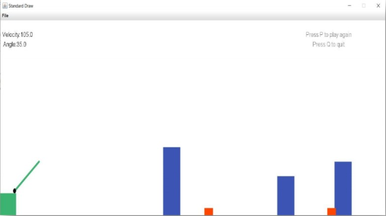

Main purpose of the program is generating N numbers of circles and find the farthest
circles between them. After find the farthest circles, program changes their thickness
and draws a red line between their center. It uses the StdDraw graphic library while
doing all this.

  
  

